# CMPE 172 - Lab #10 Notes

In this lab, I used the starter code and created a repo named *spring-gumball* in my personal GitHub Report. Then I added to GitHub Workflows via GitHub Actions.

* In the /labs/lab10 folder, include
  * images
  * README.md

## CI Workflow

Code and commit to master branch to trigger the action

Screenhot of my result

## CD Workflow

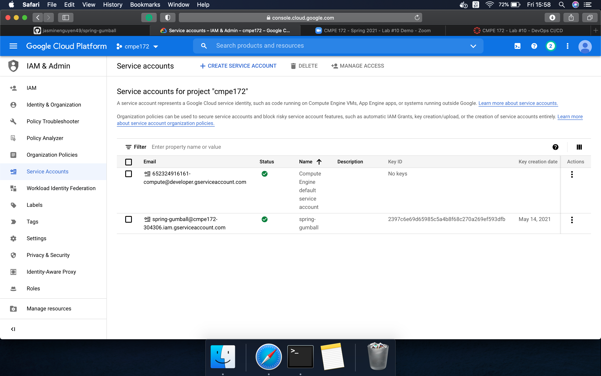

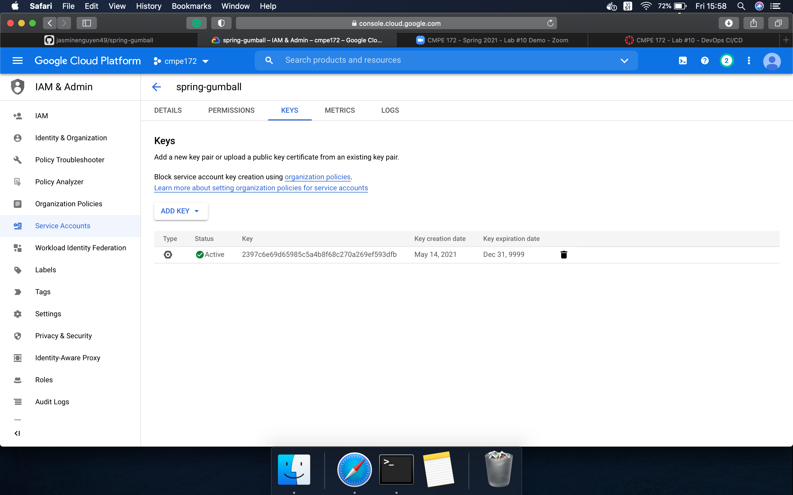

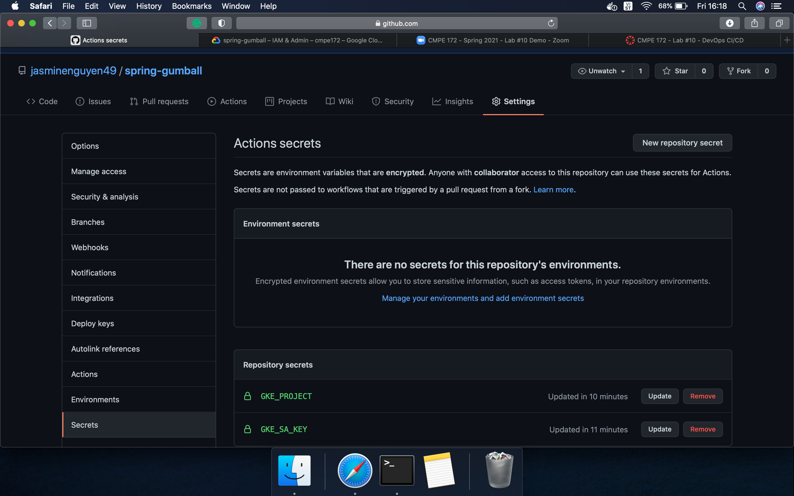

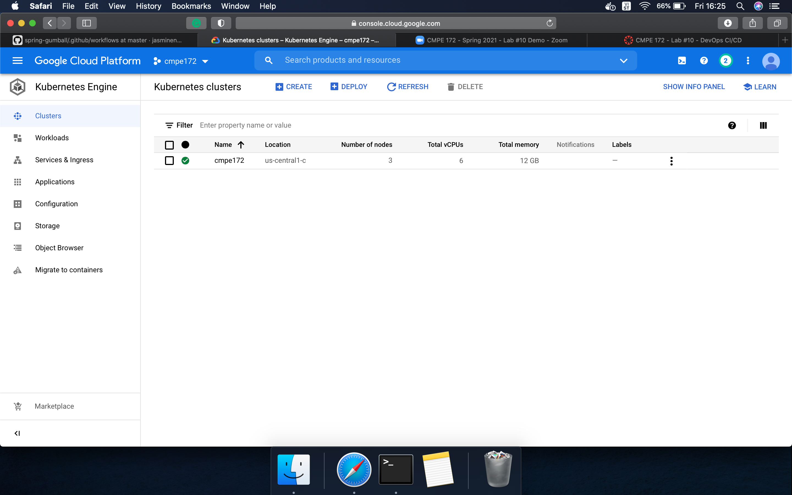

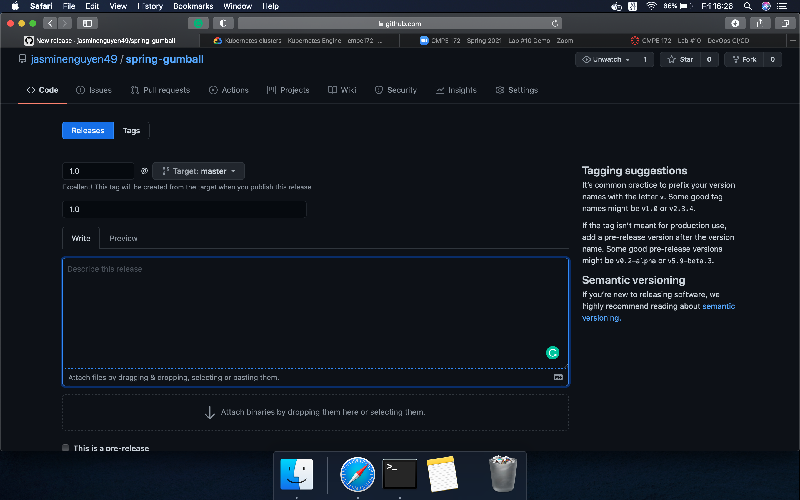

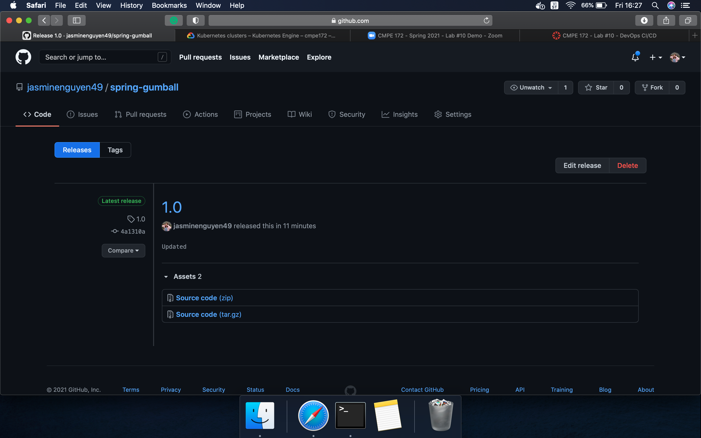

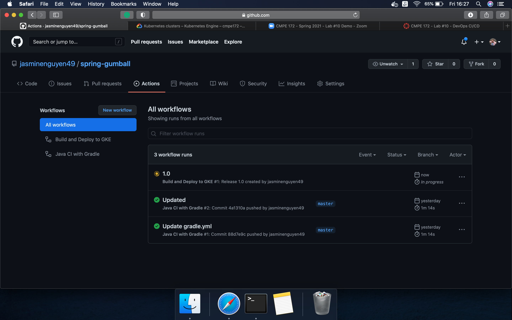

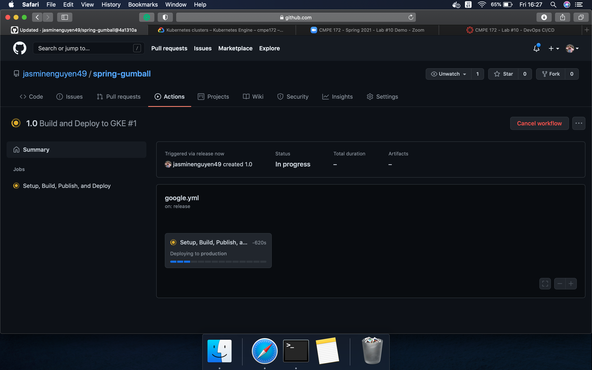

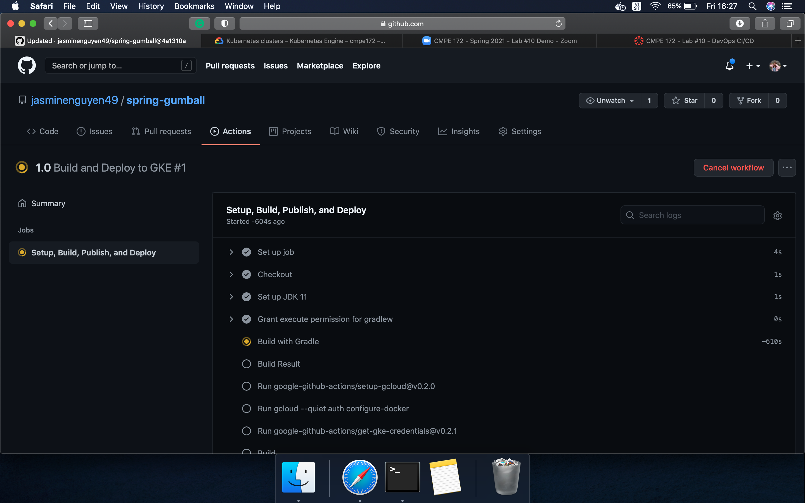

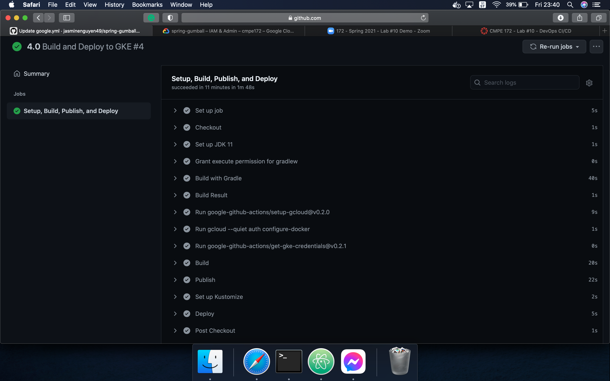

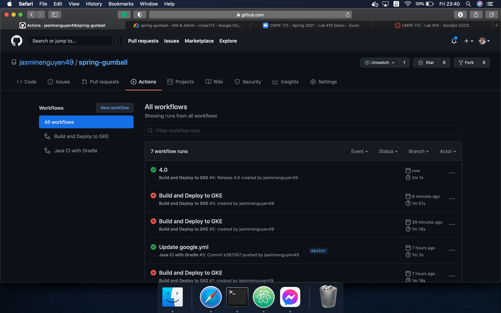

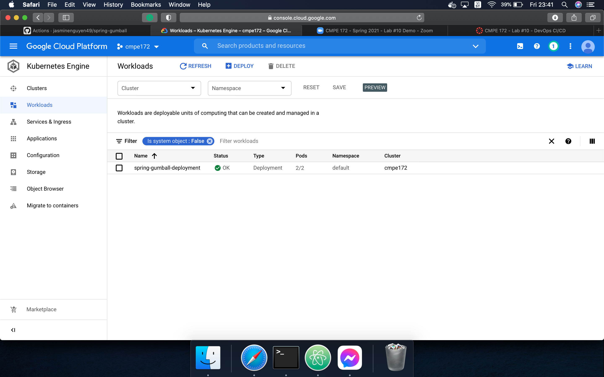

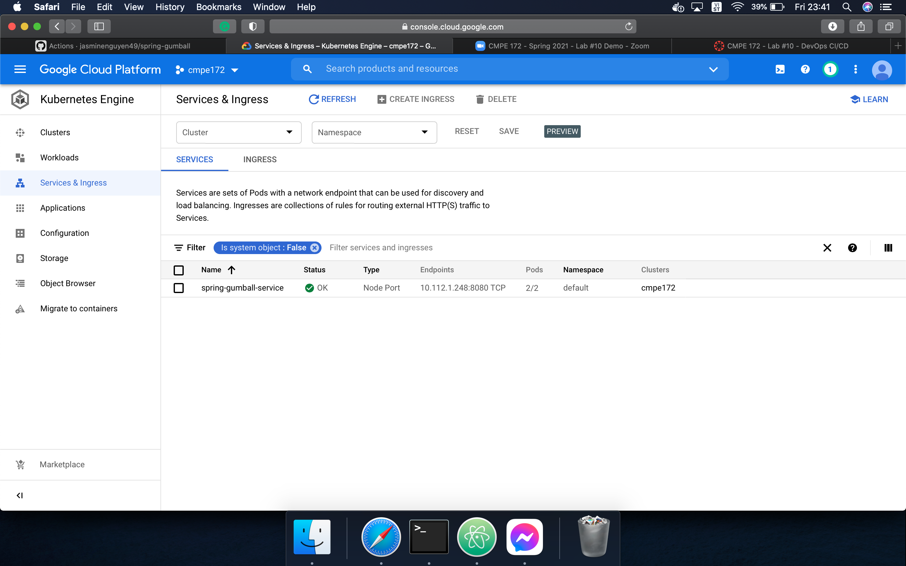

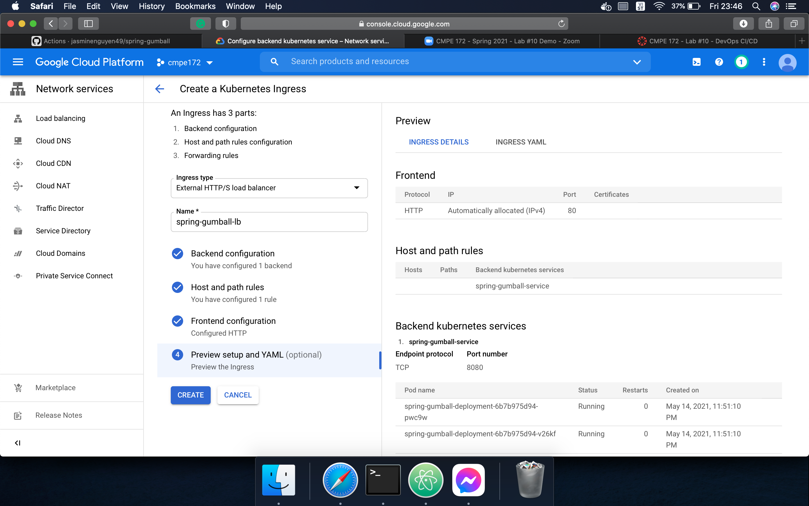

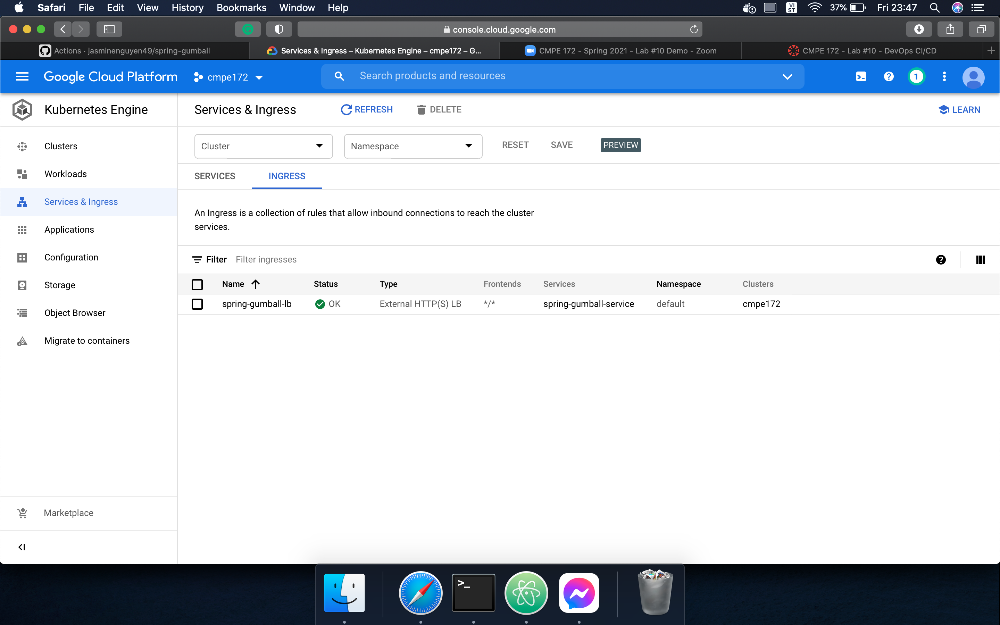

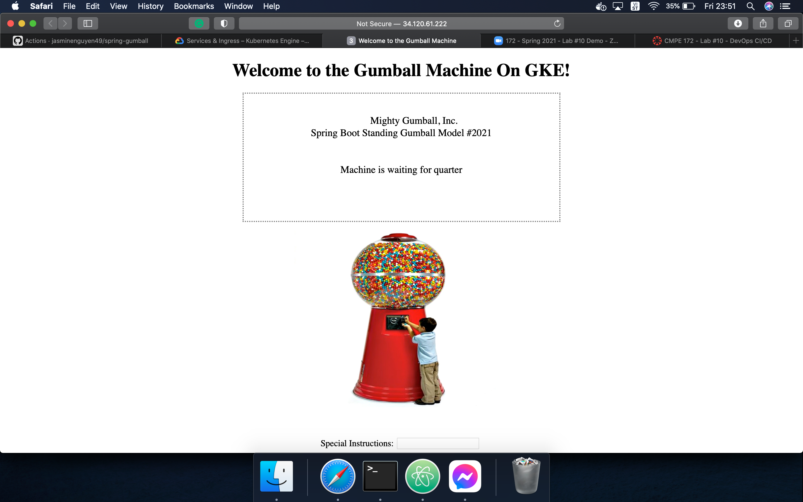

### References
* https://github.com/paulnguyen/cmpe172/tree/main/labs/lab10
* https://github.com/paulnguyen/cmpe172/tree/main/labs/lab10/starter-code/spring-gumball